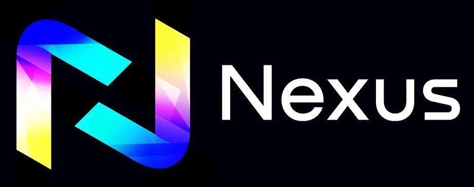
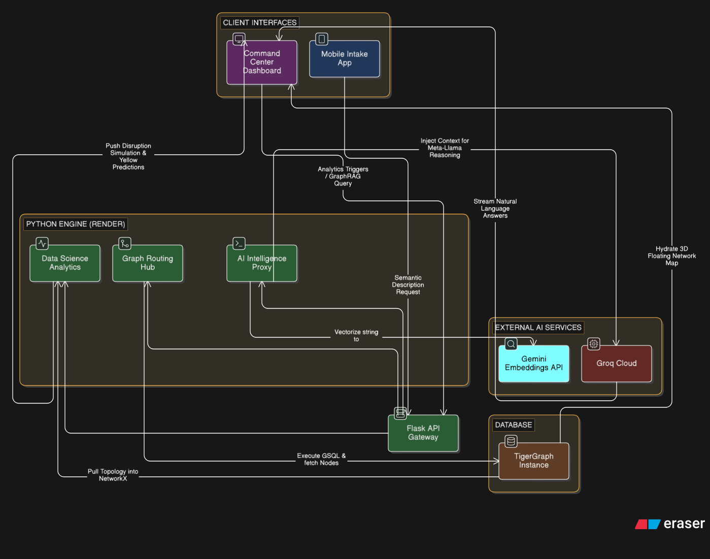

<div align="center">
  

  <h1>Project Nexus</h1>
  <p><strong>The Autonomous Criminal Network Intelligence Engine</strong></p>

  <p>
    
    
    
    
    
  </p>
  
  <i>An Aatmanirbhar (Homegrown) submission for the Devcation Delhi Hackathon (TigerGraph Track)</i>
  <br /><br />
</div>

---

## The Core Problem
Modern criminal syndicates do not operate in silos; they maneuver through deeply complex, cross-jurisdictional networks spanning aliases, burner communications, and distributed hawala financial rings. 

However, modern law enforcement infrastructure (such as India's current CCTNS 1.0) inherently relies on rigid, siloed Relational Data structures. 
* **The Intelligence Gap:** Attempting to uncover hidden, multi-hop associations (e.g., an auto-thief in Delhi sharing a bank account with an arms dealer in Punjab) using traditional SQL `JOIN` statements scales terribly, resulting in days or weeks of manual table cross-referencing.
* **Prohibitive Costs:** Sovereign enterprise intelligence solutions (like Palantir Gotham) cost hundreds of millions of dollars and require highly specialized training to operate, abandoning localized task-forces.

## The Native Solution
Project Nexus was designed to crush this capability gap. It abstracts away flat tables in favor of a **structurally aware Graph Database**. Rather than acting as a simple digital ledger, Nexus actively maps real-time data inputs (FIRs, call records, financial ledgers), running rigorous mathematical algorithms over the graph topology to expose unseen organizational structures instantly.

---

## Technical Features & Capabilities

### 1. 3D Generative Intelligence Matrix (Command Center)
A high-performance Single Page Application built on React and WebGL (`react-force-graph-3d`). It translates massive graph edge data points into an interactive, physics-based 3D universe that analysts can manipulate, zoom, and interrogate at 60 FPS without heavy local compute costs.

### 2. Predictive Data Science Engine
Under the hood, Project Nexus does not rely on simple counting logic. We utilized the Python `NetworkX` library to construct rigorous, temporally predictive heuristics:
* **Temporal Link Forecasting:** Utilizes local Jaccard Similarity and undirected Adamic-Adar math to predict structurally likely future connections *before* they manifest in real criminal records.
* **Dynamic Threat Valuation:** Rather than relying on static crime counts, Nexus leverages normalized **PageRank Centrality** arrays across the entire database to evaluate true operational influence, flagging hidden kingpins even if their direct rap sheet is clean.
* **Network Disruption Simulator:** Leverages edge **Betweenness Centrality** testing to simulate high-impact arrests. The system dynamically drops the specified vertex and calculates subsequent structural `Capacity Loss %` and isolated assets to find the most devastating tactical targets.

### 3. "No-Bloat" GraphRAG (AI Co-Pilot)
We explicitly avoided black-box API SDKs (like Langchain). Project Nexus uses raw Python `requests` logic to build a fully bespoke, in-house GraphRAG workflow:
1. Translates natural language questions into structurally aware prompts.
2. Intercepts local TigerGraph Schema topologies via `pyTigerGraph`.
3. Injects this context purely into **Groq Cloud (Meta-Llama 3.3 70B)** logic arrays to perform complex reasoning, allowing analysts to literally "Chat" with their entire criminal database.

### 4. Semantic Pipeline (Mobile Intake to Vector Search)
Field officers equipped with the Flutter companion app can verbally dictate or type vague suspect descriptions (e.g., *"Tall individual in Karol Bagh with a scar"*). The Flask API immediately bounces this off the **Google Gemini REST API** generating massive float embedding vectors, which are pushed directly into TigerGraph's native Semantic Vector Index to return immediate hybrid matches.

### 5. Automated Intelligence Dossiers
With a single click on the Command Center, Nexus isolates the targeted suspect, fetches all 1st and 2nd degree financial/communication relationships, and dynamically renders a formatted, professional **Law Enforcement Threat PDF** leveraging server-side Python `reportlab` byte generation.

---

## Data Sources & Methodology

> *"Due to the highly sensitive and classified nature of actual law enforcement records (CCTNS, CDRs, and banking transactions), NEXUS utilizes a custom-built, temporally-aware synthetic data generator.*
>
> *However, to ensure the algorithms are tested against real-world conditions, this dataset is not randomly generated. It is meticulously modeled after declassified topological patterns found in NIA charge sheets and NCRB crime statistics.*
>
> *The dataset accurately replicates complex Indian criminal behaviors, including:*
> - *Multi-hop Hawala financial layering chains*
> - *Burner phone clustering and dormancy patterns*
> - *Shell company director networks*
> - *Syndicate recruitment and growth over a 12-month temporal axis*
>
> *This ensures that our graph algorithms and predictors (PageRank, Betweenness Centrality, and Temporal Link Prediction) operate on realistic adversarial data structures, proving the system's efficacy for real-world deployment without compromising civilian privacy."*

---

## System Architecture Diagram


Below is the macro-level routing logic demonstrating our microservice capability between the independent Vercel, Render, and TigerGraph cloud clusters.

<div align="center">
  
</div>

---

## Competitive Advantage (Project Nexus vs Legacy)
| Feature Core | Legacy Systems (CCTNS/SQL) | Project Nexus (TigerGraph) |
| :--- | :--- | :--- |
| **Relationship Mapping** | Manual disjointed table joins (Hours/Days) | Sub-second multi-hop execution |
| **Search Paradigm** | Exact Text Match (Name/DOB only) | Native Temporal Vector Search (Gemini) |
| **Intelligence Querying** | Strict SQL Syntax | Enterprise Natural Language GraphRAG |
| **Data Science Analytics** | Basic Statistical Counting | Dynamic PageRank Scores & Disruption Arrays |
| **Future Crime Prevention**| Not applicable | Temporal Jaccard Association forecasting |
| **Reporting & Export** | Manually re-typed | 1-Click Automated ReportLab PDF Synthesis |

---

## Developer & Local Testing Guide

### 1. Database Initializer (TigerGraph)
The backend requires a `CriminalGraph` schema operating on either a local Docker container or TigerGraph Cloud. Map your respective environment variables inside `flask_backend/.env` regarding `TG_HOSTNAME`, `TG_USERNAME`, and `TG_PASSWORD`.

### 2. Backend Boot sequence (Python/Flask)
Execute the massive-data processing hub:
```bash
cd flask_backend
python -m venv venv

# Windows Start
.\venv\Scripts\Activate.ps1
# Mac/Linux Start
source venv/bin/activate

pip install -r requirements.txt

# Engage the Render-ready Flask/Gunicorn bridge
python app.py
```
*API successfully mounted on http://127.0.0.1:5000*

### 3. Frontend Tactical Render (React+Vite)
Boot the WebGL Command SPA:
```bash
cd frontend
npm install
npm run dev
```
*Platform visually deployed on http://localhost:5173*
